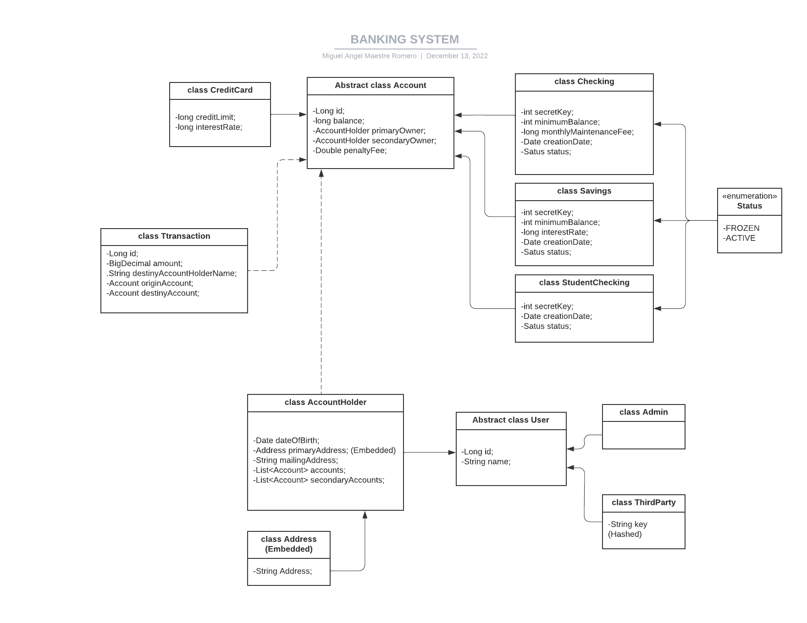

**BANKING APP - FINAL PROJECT**

The main objective of the project is to create an API for a banking system through which we can create different users, accounts and make transactions.

**REQUIREMENTS**

The system must have 4 types of accounts: 

    -StudentChecking.
    -Checking.
    -Savings
    -CreditCard.

The system must have 3 types of Users: 

    -Admins.
    -AccountHolders.
    -ThirdParty.

**ADMINS:** can create new accounts and can access the balance of any account.

**ACCOUNT HOLDERS:** can access their own account balance and transfer money from any of their accounts to another account.

**THIRD-PARTY USER:** can transfer money from any of their accounts to another account.

**TECHNICAL REQUIREMENTS**

-Java/Spring Boot backend.
-Everything should be stored in MySQL database tables.

-Include at least 1 GET, POST, PUT/PATCH, and DELETE route.

-Include authentication with Spring Security. (It's not done)

-Include unit and integration tests.

-Include robust error handling.

**UML DIAGRAM**

**METHODS**

- *createCheckingAccount.* When creating a new Checking account, if the primaryOwner is less than 24, a StudentChecking account should be created otherwise a regular Checking Account should be created.
- *updateAccountBalance:* 
  - Interest on credit cards is added to the balance monthly.
  - Interest on savings accounts is added to the account annually at the rate of specified interestRate per year.
- *checkTransaction.*  The transfer should only be processed if the account has sufficient funds. The user must provide the Primary or Secondary owner’s name and the id of the account that should receive the transfer. If any account drops below the minimumBalance, the penaltyFee should be deducted from the balance automatically

